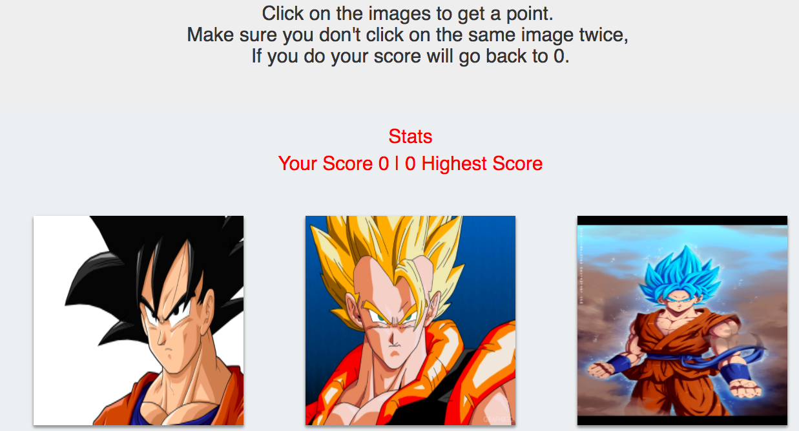

# Memory Game

Once inside the game, click on any of the images to make your score go up, everytime you click on an image the images suffle around. Try to keep click all of them without clicking more than once on each of the images.

## Getting Started

Download or clone this repo to your computer and run 'yarn start' on your terminal to open the game on your browser, alternatevely you can just click on the heroku link at the bottom of the page and that would take you to the online game.

## Built With

* [React](https://reactjs.org/) - React is a JavaScript library for building user interfaces. It is maintained by Facebook, Instagram and a community of individual developers and corporations. 

## Author

* **Jose Perez** - *Initial work* - [Memory_Game](https://github.com/jperez650/memory_game)(https://nameless-caverns-15655.herokuapp.com/)

## License

This project is licensed under the MIT License - see the [LICENSE.md](LICENSE.md) file for details
